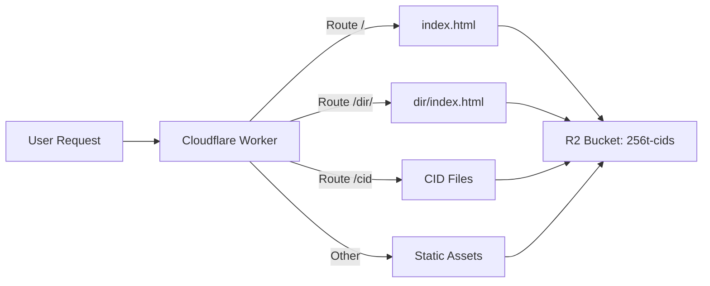

Cloudflare R2 provides S3-compatible object storage with zero egress fees. The 256t.org production site is hosted on R2, with both static site files and content-addressable CID storage coexisting in the same bucket.

## Live URL

<Card title="Production Site" icon="globe" href="https://256t.org">
  **https://256t.org**

  Served via Cloudflare R2 with Worker routing
</Card>

## Architecture

The deployment uses a single R2 bucket with a Cloudflare Worker for routing:



### Bucket Structure

The `256t-cids` bucket hosts two types of content:

<AccordionGroup>
  <Accordion title="Static Site Files">
    Generated website files:
    - `index.html` - Main page
    - `publishing.html`, `faq.html` - Documentation pages
    - `implementations/` - Code examples
    - `examples/` - Test files
    - `cids.json` - CID index metadata
  </Accordion>

  <Accordion title="CID Files">
    Content-addressable storage:
    - 94-character base64url strings
    - Immutable content with cryptographic verification
    - Cached for 1 year with `immutable` directive
    - Uploaded monthly or on-demand

    Example CID:
    ```
    base64url-sha256-AAAAAAAAAAAAAAAAAAAAAAAAAAAAAAAAAAAAAAAAAAA_ThisIsSixtyFourCharactersLong
    ```
  </Accordion>
</AccordionGroup>

<Note>
  The two file types coexist without conflicts because CIDs use a specific 94-character naming scheme that doesn't overlap with typical file names.
</Note>

## Workflows

Cloudflare deployment uses two GitHub Actions workflows:

### 1. Site Deployment

**Workflow**: `.github/workflows/deploy-cloudflare.yml`

**Triggers**:
- Push to `main` branch
- Manual via workflow dispatch

**Purpose**: Deploys static site files to R2

### 2. CID Upload

**Workflow**: `.github/workflows/r2-upload.yml`

**Triggers**:
- Monthly on 1st at 2:00 AM UTC
- Manual via workflow dispatch

**Purpose**: Uploads and verifies CID files

## Required Secrets

Both workflows require two GitHub repository secrets:

<Steps>
  <Step title="CLOUDFLARE_ACCOUNT_ID">
    Your Cloudflare Account ID.

    **How to find**:
    - Check the Cloudflare Dashboard URL:
      ```
      https://dash.cloudflare.com/<ACCOUNT_ID>
      ```
    - Or navigate to **Account Settings** → **Account ID**

    **How to add**:
    1. Go to GitHub repository → **Settings** → **Secrets and variables** → **Actions**
    2. Click **New repository secret**
    3. Name: `CLOUDFLARE_ACCOUNT_ID`
    4. Value: Your account ID
  </Step>

  <Step title="CLOUDFLARE_API_TOKEN">
    API token with required permissions.

    **Required permissions**:
    - Account → Cloudflare Pages: **Edit**
    - Account → Workers R2 Storage: **Edit**
    - Account → Workers Scripts: **Edit**
    - Zone → Zone: **Read**
    - Zone → Workers Routes: **Edit**

    See [detailed setup instructions](#api-token-setup) below.
  </Step>
</Steps>

## API Token Setup

Create a Cloudflare API token with precise permissions:

<Steps>
  <Step title="Access Token Creation">
    1. Go to [Cloudflare Dashboard](https://dash.cloudflare.com/)
    2. Click profile icon → **My Profile** → **API Tokens**
    3. Click **Create Token** → **Custom token** → **Get started**
  </Step>

  <Step title="Configure Permissions">
    Add these permissions:

    | Category | Permission | Access |
    |----------|-----------|--------|
    | Account | Cloudflare Pages | Edit |
    | Account | Workers R2 Storage | Edit |
    | Account | Workers Scripts | Edit |
    | Zone | Zone | Read |
    | Zone | Workers Routes | Edit |

    Click **+ Add more** after each permission.
  </Step>

  <Step title="Set Resources">
    **Account Resources**:
    - Include → Your account name (or All accounts)

    **Zone Resources**:
    - Include → Specific zone → `256t.org`
  </Step>

  <Step title="Create and Copy Token">
    1. Click **Continue to summary**
    2. Review permissions
    3. Click **Create Token**
    4. **Copy the token immediately** (you won't see it again)

    Token format:
    ```
    Wv1234567890abcdefghijklmnopqrstuvwxyzABCDE
    ```
  </Step>

  <Step title="Add to GitHub Secrets">
    1. Go to repository → **Settings** → **Secrets and variables** → **Actions**
    2. Click **New repository secret**
    3. Name: `CLOUDFLARE_API_TOKEN`
    4. Value: Paste the token
    5. Click **Add secret**
  </Step>
</Steps>

<Warning>
  Store the token securely. If lost, you must create a new one.
</Warning>

## Site Deployment Workflow

The `.github/workflows/deploy-cloudflare.yml` workflow:

```yaml
name: Deploy site to Cloudflare R2

on:
  push:
    branches:
      - main
  workflow_dispatch:

concurrency:
  group: "cloudflare-r2"
  cancel-in-progress: true
```

### Deployment Steps

<Steps>
  <Step title="Checkout Repository">
    ```yaml
    - name: Check out repository
      uses: actions/checkout@v4
    ```
  </Step>

  <Step title="Build Static Site">
    Identical to GitHub Pages build:
    1. Install Python and `markdown` library
    2. Convert Markdown files to HTML
    3. Generate `cids.json` index
    4. Copy resources to `dist/`
  </Step>

  <Step title="Install Wrangler">
    ```yaml
    - name: Set up Node.js for Wrangler
      uses: actions/setup-node@v4
      with:
        node-version: '20'

    - name: Install Wrangler
      run: npm install -g wrangler
    ```
  </Step>

  <Step title="Deploy to R2">
    ```yaml
    - name: Deploy static files to R2
      env:
        CLOUDFLARE_ACCOUNT_ID: ${{ secrets.CLOUDFLARE_ACCOUNT_ID }}
        CLOUDFLARE_API_TOKEN: ${{ secrets.CLOUDFLARE_API_TOKEN }}
      run: |
        python .github/scripts/r2_static_upload.py dist
    ```

    The upload script:
    - Uploads all files from `dist/` to R2
    - Sets appropriate cache headers
    - Preserves directory structure
  </Step>
</Steps>

## CID Upload Workflow

The `.github/workflows/r2-upload.yml` workflow handles CID file uploads:

```yaml
name: Upload CIDs to CloudFlare R2

on:
  workflow_dispatch:
  schedule:
    - cron: '0 2 1 * *'  # Monthly on 1st at 2 AM UTC
```

### Upload Process

<Steps>
  <Step title="Setup Environment">
    Installs Python, Node.js, and Wrangler CLI:
    ```yaml
    - name: Set up Python
      uses: actions/setup-python@v5
      with:
        python-version: '3.12'

    - name: Set up Node.js for Wrangler
      uses: actions/setup-node@v4
      with:
        node-version: '20'

    - name: Install Wrangler
      run: npm install -g wrangler
    ```
  </Step>

  <Step title="Upload and Verify CIDs">
    ```bash
    failed=0
    for file in cids/*; do
      if [ -f "$file" ]; then
        echo "Processing $file..."
        if ! python .github/scripts/r2_upload.py "$file"; then
          echo "Failed to upload $file"
          failed=$((failed + 1))
        fi
      fi
    done

    if [ $failed -gt 0 ]; then
      echo "Failed to upload $failed file(s)"
      exit 1
    fi
    ```
  </Step>
</Steps>

## R2 Upload Script

The `.github/scripts/r2_upload.py` script provides CID verification and upload:

```python
#!/usr/bin/env python3
"""
R2 Upload Script for 256t.org Content-Addressable Storage

Uploads files to Cloudflare R2 using their CID as the key.
Uses Wrangler CLI for all R2 operations.
"""

import sys
from pathlib import Path
import subprocess
import tempfile
import os

sys.path.insert(0, str(
    Path(__file__).resolve().parents[2] / "implementations" / "python"
))

from cid import compute_cid

BUCKET_NAME = "256t-cids"

def run_wrangler_command(args: list) -> tuple[int, str, str]:
    """Run a wrangler command and return the result."""
    cmd = ['npx', 'wrangler'] + args
    result = subprocess.run(cmd, capture_output=True, text=True)
    return result.returncode, result.stdout, result.stderr

def check_object_exists(cid: str) -> tuple[bool, bytes]:
    """Check if an object exists in R2 and return its content."""
    fd, tmp_path = tempfile.mkstemp()
    
    try:
        os.close(fd)
        object_path = f"{BUCKET_NAME}/{cid}"
        returncode, stdout, stderr = run_wrangler_command([
            'r2', 'object', 'get', object_path,
            '--file', tmp_path,
            '--remote'
        ])
        
        if returncode == 0:
            content = Path(tmp_path).read_bytes()
            return True, content
        else:
            if any(s in stderr.lower() for s in 
                   ['not found', 'does not exist', 'specified key']):
                return False, b''
            else:
                raise RuntimeError(f"Failed to check object: {stderr}")
    finally:
        if os.path.exists(tmp_path):
            os.unlink(tmp_path)

def upload_to_r2(file_path: Path) -> str:
    """Upload a file to R2 using its CID as the key."""
    content = file_path.read_bytes()
    cid = compute_cid(content)
    
    # Check if object already exists
    exists, remote_content = check_object_exists(cid)
    
    if exists:
        remote_cid = compute_cid(remote_content)
        if remote_cid == cid:
            print(f"Object already exists with matching CID. Skipping.")
            return cid
        else:
            raise ValueError("Content CID mismatch!")
    
    # Upload to R2
    object_path = f"{BUCKET_NAME}/{cid}"
    returncode, stdout, stderr = run_wrangler_command([
        'r2', 'object', 'put', object_path,
        '--file', str(file_path),
        '--cache-control', 'public, max-age=31536000, immutable',
        '--content-type', 'application/octet-stream',
        '--remote'
    ])
    
    if returncode != 0:
        raise RuntimeError(f"Upload failed: {stderr}")
    
    return cid
```

### Key Features

<AccordionGroup>
  <Accordion title="Content Verification">
    Before uploading, the script:
    1. Computes CID from file content
    2. Checks if object exists on R2
    3. If exists, downloads and verifies CID matches
    4. Skips upload if CID is already correct
    5. Fails if existing content doesn't match
  </Accordion>

  <Accordion title="Immutable Cache Headers">
    CID files are uploaded with:
    ```
    Cache-Control: public, max-age=31536000, immutable
    ```

    This means:
    - Cached for 1 year (31536000 seconds)
    - `immutable` - Content will never change
    - `public` - Can be cached by CDN and browsers
  </Accordion>

  <Accordion title="Wrangler Integration">
    Uses Cloudflare's official CLI:
    - `wrangler r2 object get` - Download objects
    - `wrangler r2 object put` - Upload objects
    - Automatic authentication via env vars
  </Accordion>
</AccordionGroup>

## Cache Configuration

Different file types use optimized cache strategies:

| File Type | Cache-Control | Rationale |
|-----------|--------------|----------|
| HTML files (`*.html`) | `max-age=300` (5 min) | Allow quick content updates |
| JSON files (`*.json`) | `max-age=300` (5 min) | Metadata can change |
| Static assets (CSS/JS/images) | `max-age=3600` (1 hour) | Longer cache for assets |
| CID files | `max-age=31536000, immutable` | Never change, cache forever |

## Manual Deployment

### Deploy Site Files

<Steps>
  <Step title="Navigate to Actions">
    Go to repository → **Actions** tab
  </Step>

  <Step title="Select Workflow">
    Click **Deploy site to Cloudflare R2**
  </Step>

  <Step title="Run Workflow">
    Click **Run workflow** → Select `main` → **Run workflow**
  </Step>

  <Step title="Monitor Progress">
    Watch the workflow logs. Deployment takes ~1-2 minutes.
  </Step>
</Steps>

### Upload CID Files

<Steps>
  <Step title="Navigate to Actions">
    Go to repository → **Actions** tab
  </Step>

  <Step title="Select Workflow">
    Click **Upload CIDs to CloudFlare R2**
  </Step>

  <Step title="Run Workflow">
    Click **Run workflow** → Select `main` → **Run workflow**
  </Step>

  <Step title="Monitor Progress">
    The workflow processes each CID file:
    - Computes CID from content
    - Checks if already on R2
    - Uploads if missing or verifies if exists
    - Fails if any discrepancies found
  </Step>
</Steps>

## Troubleshooting

<AccordionGroup>
  <Accordion title="Authentication Error">
    **Problem**: `Error: Authentication failed`

    **Solutions**:
    1. Verify `CLOUDFLARE_API_TOKEN` secret is set correctly
    2. Check token hasn't expired (go to Cloudflare Dashboard → Profile → API Tokens)
    3. Ensure token has required permissions
    4. Try creating a new token
  </Accordion>

  <Accordion title="Missing R2 Permissions">
    **Problem**: `Error: You do not have permission to access this resource`

    **Solution**: Update API token permissions:
    1. Go to Cloudflare Dashboard → Profile → API Tokens
    2. Edit your token
    3. Ensure "Workers R2 Storage: Edit" permission is set
    4. Update GitHub secret with new token if needed
  </Accordion>

  <Accordion title="CID Verification Failed">
    **Problem**: `Content CID mismatch! Expected: X, Found: Y`

    **Solution**: The R2 object content doesn't match its CID:
    1. This indicates data corruption or incorrect upload
    2. Delete the object from R2:
       ```bash
       wrangler r2 object delete 256t-cids/<cid> --remote
       ```
    3. Re-run the upload workflow
  </Accordion>

  <Accordion title="Worker Not Routing Correctly">
    **Problem**: Site deploys but shows 404 or serves wrong content

    **Solution**: Check the Cloudflare Worker:
    1. Ensure worker is deployed (see [Cloudflare Worker](/deployment/cloudflare-worker))
    2. Verify R2 bucket binding in `wrangler.toml`
    3. Check worker routes in Cloudflare Dashboard
  </Accordion>
</AccordionGroup>

## Next Steps

<CardGroup cols={2}>
  <Card title="Cloudflare Worker" icon="code" href="/deployment/cloudflare-worker">
    Set up the routing worker to serve your site
  </Card>
  <Card title="GitHub Pages" icon="github" href="/deployment/github-pages">
    Configure backup hosting on GitHub Pages
  </Card>
</CardGroup>
