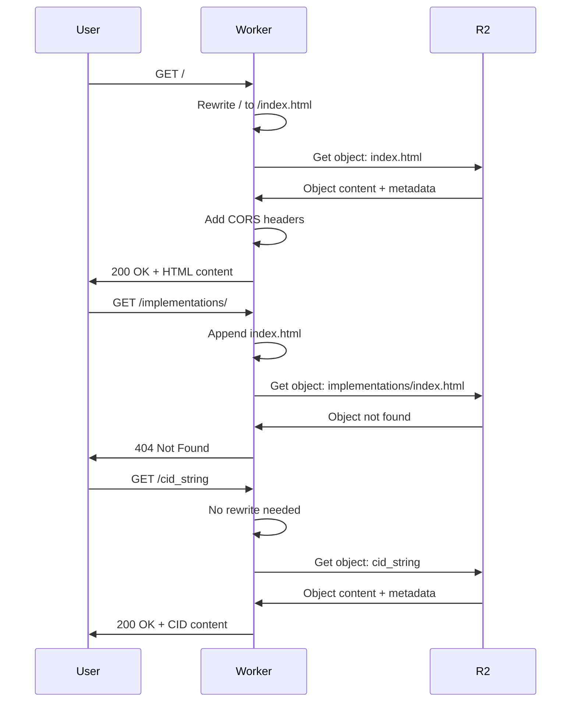

The Cloudflare Worker acts as a lightweight proxy between users and the R2 bucket. It handles routing logic to serve `index.html` for directory paths and proxies all other requests directly to R2.

## Purpose

The worker solves a common static hosting issue: accessing `https://256t.org/` would return a 404 error without it. 

### What It Does

<CardGroup cols={2}>
  <Card title="Root Path Routing" icon="house">
    Serves `index.html` when accessing `/`
  </Card>
  <Card title="Directory Routing" icon="folder">
    Serves `index.html` for paths ending in `/`
  </Card>
  <Card title="CORS Headers" icon="globe">
    Adds headers for cross-origin access
  </Card>
  <Card title="Direct Proxy" icon="forward">
    Passes through all other requests to R2
  </Card>
</CardGroup>

## Worker Code

The complete worker implementation from `worker.js`:

```javascript
/**
 * Cloudflare Worker for 256t.org
 * 
 * This worker sits in front of the R2 bucket and handles:
 * 1. Serving index.html for the root path (/)
 * 2. Serving index.html for directory paths
 * 3. Proxying all other requests to R2
 */

export default {
  async fetch(request, env) {
    const url = new URL(request.url);
    let path = url.pathname;

    // Handle CORS preflight requests
    if (request.method === 'OPTIONS') {
      return new Response(null, {
        status: 204,
        headers: {
          'Access-Control-Allow-Origin': '*',
          'Access-Control-Allow-Methods': 'GET, HEAD, OPTIONS',
          'Access-Control-Allow-Headers': 'Content-Type',
          'Access-Control-Max-Age': '86400',
        },
      });
    }

    // Handle root path - serve index.html
    if (path === '/' || path === '') {
      path = '/index.html';
    }
    // Handle directory paths - serve index.html if it exists
    else if (path.endsWith('/')) {
      path = path + 'index.html';
    }

    // Remove leading slash for R2 key
    const key = path.startsWith('/') ? path.slice(1) : path;

    try {
      // Try to get the object from R2
      const object = await env.BUCKET.get(key);

      if (object === null) {
        // Object not found - return 404
        return new Response('Not Found', { 
          status: 404,
          headers: {
            'Content-Type': 'text/plain'
          }
        });
      }

      // Get headers from R2 object
      const headers = new Headers();
      object.writeHttpMetadata(headers);
      headers.set('etag', object.httpEtag);

      // Add CORS headers for web access
      headers.set('Access-Control-Allow-Origin', '*');
      headers.set('Access-Control-Allow-Methods', 'GET, HEAD, OPTIONS');
      headers.set('Access-Control-Allow-Headers', 'Content-Type');

      // Return the object
      return new Response(object.body, {
        headers,
      });
    } catch (error) {
      return new Response(`Error: ${error.message}`, { 
        status: 500,
        headers: {
          'Content-Type': 'text/plain'
        }
      });
    }
  },
};
```

### Key Features

<AccordionGroup>
  <Accordion title="Path Rewriting">
    ```javascript
    // Root path → index.html
    if (path === '/' || path === '') {
      path = '/index.html';
    }
    // Directory path → directory/index.html
    else if (path.endsWith('/')) {
      path = path + 'index.html';
    }
    ```

    This allows clean URLs:
    - `256t.org/` → serves `index.html`
    - `256t.org/implementations/` → serves `implementations/index.html`
  </Accordion>

  <Accordion title="CORS Support">
    ```javascript
    // CORS preflight
    if (request.method === 'OPTIONS') {
      return new Response(null, {
        status: 204,
        headers: {
          'Access-Control-Allow-Origin': '*',
          'Access-Control-Allow-Methods': 'GET, HEAD, OPTIONS',
          'Access-Control-Allow-Headers': 'Content-Type',
          'Access-Control-Max-Age': '86400',
        },
      });
    }

    // Add CORS to all responses
    headers.set('Access-Control-Allow-Origin', '*');
    ```

    Enables cross-origin requests from any domain.
  </Accordion>

  <Accordion title="R2 Integration">
    ```javascript
    // Get object from R2 bucket
    const object = await env.BUCKET.get(key);

    if (object === null) {
      return new Response('Not Found', { status: 404 });
    }

    // Preserve R2 metadata
    const headers = new Headers();
    object.writeHttpMetadata(headers);
    headers.set('etag', object.httpEtag);

    return new Response(object.body, { headers });
    ```

    Preserves cache headers and ETags from R2 objects.
  </Accordion>

  <Accordion title="Error Handling">
    ```javascript
    try {
      const object = await env.BUCKET.get(key);
      // ...
    } catch (error) {
      return new Response(`Error: ${error.message}`, { 
        status: 500,
        headers: { 'Content-Type': 'text/plain' }
      });
    }
    ```

    Returns clear error messages for debugging.
  </Accordion>
</AccordionGroup>

## Configuration

The worker is configured via `wrangler.toml`:

```toml
name = "256t-org-site"
main = "worker.js"
compatibility_date = "2024-01-01"

# Route all 256t.org traffic through this worker
routes = [
  { pattern = "256t.org", zone_name = "256t.org" },
  { pattern = "256t.org/*", zone_name = "256t.org" },
  { pattern = "www.256t.org", zone_name = "256t.org" },
  { pattern = "www.256t.org/*", zone_name = "256t.org" }
]

# Bind the R2 bucket to the worker
[[r2_buckets]]
binding = "BUCKET"
bucket_name = "256t-cids"
```

### Configuration Breakdown

<AccordionGroup>
  <Accordion title="Worker Metadata">
    ```toml
    name = "256t-org-site"
    main = "worker.js"
    compatibility_date = "2024-01-01"
    ```

    - **name**: Worker identifier in Cloudflare
    - **main**: Entry point file
    - **compatibility_date**: API version compatibility
  </Accordion>

  <Accordion title="Route Configuration">
    ```toml
    routes = [
      { pattern = "256t.org", zone_name = "256t.org" },
      { pattern = "256t.org/*", zone_name = "256t.org" },
      { pattern = "www.256t.org", zone_name = "256t.org" },
      { pattern = "www.256t.org/*", zone_name = "256t.org" }
    ]
    ```

    Handles all traffic to:
    - Root domain: `256t.org`
    - All paths: `256t.org/*`
    - WWW subdomain: `www.256t.org` and `www.256t.org/*`
  </Accordion>

  <Accordion title="R2 Bucket Binding">
    ```toml
    [[r2_buckets]]
    binding = "BUCKET"
    bucket_name = "256t-cids"
    ```

    - **binding**: Variable name in worker code (`env.BUCKET`)
    - **bucket_name**: R2 bucket to connect to
  </Accordion>
</AccordionGroup>

## Deployment

The worker is automatically deployed via GitHub Actions.

### Automatic Deployment

**Workflow**: `.github/workflows/deploy-worker.yml`

```yaml
name: Deploy Worker to Cloudflare

on:
  push:
    branches:
      - main
    paths:
      - 'worker.js'
      - 'wrangler.toml'
      - '.github/workflows/deploy-worker.yml'
  workflow_dispatch:
```

**Triggers**:
- Push to `main` when worker files change
- Manual workflow dispatch

**Steps**:

<Steps>
  <Step title="Checkout Repository">
    ```yaml
    - name: Check out repository
      uses: actions/checkout@v4
    ```
  </Step>

  <Step title="Setup Node.js">
    ```yaml
    - name: Set up Node.js
      uses: actions/setup-node@v4
      with:
        node-version: '20'
    ```
  </Step>

  <Step title="Install Wrangler">
    ```yaml
    - name: Install Wrangler
      run: npm install -g wrangler
    ```
  </Step>

  <Step title="Deploy Worker">
    ```yaml
    - name: Deploy Worker
      env:
        CLOUDFLARE_ACCOUNT_ID: ${{ secrets.CLOUDFLARE_ACCOUNT_ID }}
        CLOUDFLARE_API_TOKEN: ${{ secrets.CLOUDFLARE_API_TOKEN }}
      run: |
        wrangler deploy
    ```
  </Step>
</Steps>

### Manual Deployment

Deploy the worker manually using Wrangler CLI:

<Steps>
  <Step title="Install Wrangler">
    ```bash
    npm install -g wrangler
    ```
  </Step>

  <Step title="Authenticate">
    ```bash
    wrangler login
    ```
    Opens browser for OAuth authentication.
  </Step>

  <Step title="Set Account ID">
    ```bash
    export CLOUDFLARE_ACCOUNT_ID=your-account-id
    ```
  </Step>

  <Step title="Deploy">
    ```bash
    wrangler deploy
    ```

    Expected output:
    ```
    Total Upload: XX.XX KiB / gzip: XX.XX KiB
    Uploaded 256t-org-site (X.XX sec)
    Published 256t-org-site (X.XX sec)
      https://256t-org-site.your-subdomain.workers.dev
    Current Deployment ID: xxxxxxxx-xxxx-xxxx-xxxx-xxxxxxxxxxxx
    ```
  </Step>
</Steps>

## Route Configuration

After deploying the worker for the first time, configure routes manually:

<Warning>
  **Important**: Routes must be configured once after initial deployment. Subsequent deployments don't require this step.
</Warning>

### Via Cloudflare Dashboard

<Steps>
  <Step title="Navigate to Worker">
    1. Go to [Cloudflare Dashboard](https://dash.cloudflare.com/)
    2. Click **Workers & Pages** in the sidebar
    3. Click on **256t-org-site** worker
  </Step>

  <Step title="Access Settings">
    1. Click **Settings** tab
    2. Scroll to **Triggers** section
    3. Click **Routes**
  </Step>

  <Step title="Add Route">
    1. Click **Add route**
    2. Enter route pattern: `256t.org/*`
    3. Select zone: `256t.org`
    4. Click **Save**
  </Step>

  <Step title="Verify">
    Visit `https://256t.org/` to confirm the worker is routing correctly.
  </Step>
</Steps>

### Via Wrangler CLI

```bash
# Get your zone ID
wrangler zone list

# Add route
wrangler route add "256t.org/*" --zone-id <ZONE_ID>

# Verify routes
wrangler route list --zone-id <ZONE_ID>
```

## Testing

Test the worker locally before deploying:

### Local Development

<Steps>
  <Step title="Start Dev Server">
    ```bash
    wrangler dev
    ```

    Output:
    ```
    ⛅️ wrangler 3.x.x
    ------------------
    ⬣ Listening on http://localhost:8787
    ```
  </Step>

  <Step title="Test Root Path">
    ```bash
    curl http://localhost:8787/
    ```

    Should return the content of `index.html`.
  </Step>

  <Step title="Test Directory Path">
    ```bash
    curl http://localhost:8787/implementations/
    ```

    Should return `implementations/index.html` if it exists, or 404.
  </Step>

  <Step title="Test CID File">
    ```bash
    curl http://localhost:8787/<cid-string>
    ```

    Should return the CID file content.
  </Step>
</Steps>

<Note>
  Local development requires R2 bucket access. Ensure `CLOUDFLARE_ACCOUNT_ID` and `CLOUDFLARE_API_TOKEN` are set in your environment.
</Note>

## How It Works

Request flow through the worker:



### Request Types

<AccordionGroup>
  <Accordion title="Root Path Request">
    ```
    User Request: GET https://256t.org/
    Worker Rewrites: /index.html
    R2 Lookup: index.html
    Response: 200 OK with HTML content
    ```
  </Accordion>

  <Accordion title="Directory Request">
    ```
    User Request: GET https://256t.org/examples/
    Worker Rewrites: /examples/index.html
    R2 Lookup: examples/index.html
    Response: 200 OK or 404 Not Found
    ```
  </Accordion>

  <Accordion title="Direct File Request">
    ```
    User Request: GET https://256t.org/hash.html
    Worker: No rewrite
    R2 Lookup: hash.html
    Response: 200 OK with HTML content
    ```
  </Accordion>

  <Accordion title="CID Request">
    ```
    User Request: GET https://256t.org/base64url-sha256-ABC...
    Worker: No rewrite
    R2 Lookup: base64url-sha256-ABC...
    Response: 200 OK with immutable cache headers
    ```
  </Accordion>
</AccordionGroup>

## Environment Bindings

The worker requires one R2 bucket binding:

```toml
[[r2_buckets]]
binding = "BUCKET"
bucket_name = "256t-cids"
```

**Usage in code**:

```javascript
export default {
  async fetch(request, env) {
    // Access bucket via env.BUCKET
    const object = await env.BUCKET.get(key);
    // ...
  },
};
```

<Info>
  The `env` parameter is automatically injected by the Workers runtime and contains all configured bindings.
</Info>

## Security

### CORS Headers

The worker adds permissive CORS headers:

```javascript
headers.set('Access-Control-Allow-Origin', '*');
headers.set('Access-Control-Allow-Methods', 'GET, HEAD, OPTIONS');
headers.set('Access-Control-Allow-Headers', 'Content-Type');
```

This allows:
- Cross-origin requests from any domain
- Read-only access (GET, HEAD)
- Preflight caching for 24 hours

### Cache Headers

Cache headers are preserved from R2 objects:

```javascript
const headers = new Headers();
object.writeHttpMetadata(headers);
headers.set('etag', object.httpEtag);
```

This ensures:
- Original cache settings are respected
- ETags enable conditional requests
- CID files remain immutable

## Troubleshooting

<AccordionGroup>
  <Accordion title="Worker Returns 404 for Root">
    **Problem**: Accessing `https://256t.org/` returns 404

    **Solutions**:
    1. Verify `index.html` exists in R2 bucket
    2. Check worker routes are configured correctly
    3. Test worker code locally with `wrangler dev`
    4. Check worker logs in Cloudflare Dashboard
  </Accordion>

  <Accordion title="Routes Not Working">
    **Problem**: Worker deployed but not handling traffic

    **Solutions**:
    1. Verify routes in Cloudflare Dashboard:
       - Workers & Pages → 256t-org-site → Settings → Triggers → Routes
    2. Ensure route pattern is `256t.org/*` for zone `256t.org`
    3. Try adding route manually via dashboard
    4. Wait a few minutes for route propagation
  </Accordion>

  <Accordion title="R2 Bucket Not Accessible">
    **Problem**: `Error: BUCKET is not defined`

    **Solutions**:
    1. Check `wrangler.toml` has R2 bucket binding:
       ```toml
       [[r2_buckets]]
       binding = "BUCKET"
       bucket_name = "256t-cids"
       ```
    2. Verify bucket name matches your R2 bucket
    3. Ensure API token has R2 read permissions
    4. Redeploy worker after fixing configuration
  </Accordion>

  <Accordion title="CORS Errors in Browser">
    **Problem**: Browser console shows CORS policy errors

    **Solutions**:
    1. Verify worker is adding CORS headers (check Network tab)
    2. Ensure preflight OPTIONS requests return 204
    3. Check if worker is being bypassed (direct R2 access)
    4. Test with `curl -v` to see actual headers
  </Accordion>

  <Accordion title="Deployment Fails with Auth Error">
    **Problem**: `Error: Authentication failed`

    **Solutions**:
    1. Verify `CLOUDFLARE_API_TOKEN` secret is set
    2. Check token has "Workers Scripts: Edit" permission
    3. Ensure token hasn't expired
    4. Try manual deployment with `wrangler login`
  </Accordion>
</AccordionGroup>

## Performance

The worker adds minimal latency:

- **Cold start**: ~10-50ms
- **Warm execution**: less than 5ms
- **R2 access**: ~20-100ms (depending on region)
- **Total overhead**: ~15-55ms

<Info>
  Workers run on Cloudflare's edge network, so they execute close to the user for minimal latency.
</Info>

## Next Steps

<CardGroup cols={2}>
  <Card title="Cloudflare R2 Deployment" icon="cloud" href="/deployment/cloudflare-r2">
    Learn about deploying site files to R2
  </Card>
  <Card title="Deployment Overview" icon="book" href="/deployment/overview">
    View all deployment options
  </Card>
</CardGroup>
