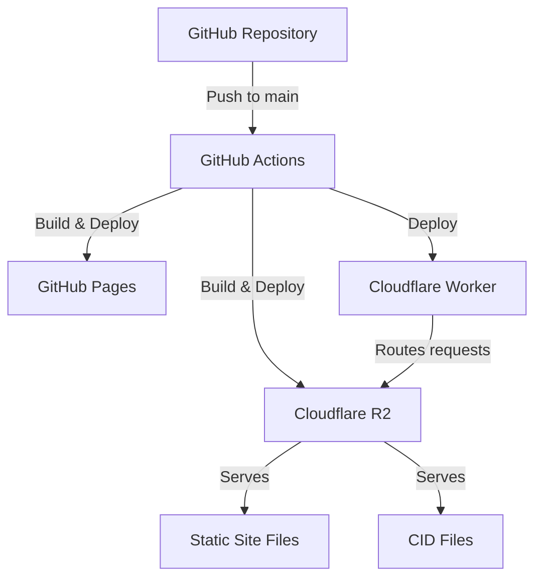

The 256t.org site uses automated GitHub Actions workflows to deploy to multiple platforms. This ensures the content-addressable storage system and documentation are always accessible.

## Deployment Targets

The site is automatically deployed to two platforms:

<CardGroup cols={2}>
  <Card title="GitHub Pages" icon="github" href="/deployment/github-pages">
    Free hosting with automatic SSL. Ideal for testing and backup hosting.
  </Card>
  <Card title="Cloudflare R2" icon="cloud" href="/deployment/cloudflare-r2">
    Production hosting with CDN. Hosts both static site files and CID storage.
  </Card>
</CardGroup>

## Architecture

The deployment architecture combines static site hosting with content-addressable storage:



### Components

<AccordionGroup>
  <Accordion title="Static Site Generator">
    The build process converts Markdown files to HTML:
    - `README.md` → `index.html` (main page)
    - `PUBLISHING.md` → `publishing.html`
    - `FAQ.md` → `faq.html`
    - Copies resource directories (`implementations/`, `examples/`, `cids/`)
    - Generates `cids.json` index file

    All files are output to the `dist/` directory.
  </Accordion>

  <Accordion title="Cloudflare Worker">
    A lightweight proxy worker handles routing:
    - Serves `index.html` for root and directory paths
    - Proxies all other requests to R2 bucket
    - Adds CORS headers for cross-origin access
    - Preserves cache headers from R2 objects

    See [Cloudflare Worker](/deployment/cloudflare-worker) for details.
  </Accordion>

  <Accordion title="R2 Bucket">
    The `256t-cids` bucket hosts two types of content:
    - **Static site files**: HTML, CSS, JS, images
    - **CID files**: Content-addressable storage (94-character base64url strings)

    Both coexist without conflicts due to non-overlapping naming schemes.
  </Accordion>
</AccordionGroup>

## Build Process

All deployments use the same build steps:

<Steps>
  <Step title="Install Dependencies">
    ```bash
    python -m pip install --upgrade pip
    python -m pip install markdown
    ```
  </Step>

  <Step title="Generate Site Files">
    Python script converts Markdown to HTML using the `markdown` library with extensions:
    - `fenced_code` - Code block support
    - `tables` - Table formatting
    - `toc` - Table of contents
    - `sane_lists` - Improved list handling
  </Step>

  <Step title="Copy Resources">
    All directories and files are copied to `dist/` except:
    - `.git/`
    - `.github/`
    - `dist/` (output directory)
  </Step>

  <Step title="Generate CID Index">
    Creates `cids.json` with metadata for all CID files:
    ```json
    [
      {
        "cid": "cid_full_string",
        "cidPreview": "first_20_chars",
        "textPreview": "first_100_bytes",
        "length": 42
      }
    ]
    ```
  </Step>
</Steps>

## Deployment URLs

<CardGroup cols={2}>
  <Card title="Production" icon="globe">
    **https://256t.org**

    Served via Cloudflare R2 with Worker routing
  </Card>
  <Card title="GitHub Pages" icon="github">
    **https://curtcox.github.io/256t.org/**

    Backup hosting and testing environment
  </Card>
</CardGroup>

## Deployment Triggers

All workflows can be triggered in two ways:

### Automatic Deployment

Workflows run automatically on push to `main` branch:

```yaml
on:
  push:
    branches:
      - main
```

### Manual Deployment

All workflows support manual triggering via GitHub Actions UI:

```yaml
on:
  workflow_dispatch:
```

<Note>
  Navigate to **Actions** tab → Select workflow → Click **Run workflow** button
</Note>

## Cache Configuration

Different file types use different cache strategies:

| File Type | Cache-Control | Duration |
|-----------|--------------|----------|
| HTML/JSON files | `max-age=300` | 5 minutes |
| Static assets (CSS/JS/images) | `max-age=3600` | 1 hour |
| CID files | `max-age=31536000, immutable` | 1 year |

<Info>
  CID files are immutable by design - their content is cryptographically bound to their filename, so they can be cached indefinitely.
</Info>

## Required Secrets

Cloudflare deployments require two GitHub repository secrets:

<AccordionGroup>
  <Accordion title="CLOUDFLARE_ACCOUNT_ID">
    Your Cloudflare Account ID

    **How to find:**
    - Cloudflare Dashboard URL: `https://dash.cloudflare.com/<ACCOUNT_ID>`
    - Or navigate to **Account Settings** → **Account ID**
  </Accordion>

  <Accordion title="CLOUDFLARE_API_TOKEN">
    API token with required permissions:
    - Account → Cloudflare Pages: Edit
    - Account → Workers R2 Storage: Edit
    - Account → Workers Scripts: Edit
    - Zone → Zone: Read
    - Zone → Workers Routes: Edit

    See [Cloudflare R2 Deployment](/deployment/cloudflare-r2#required-secrets) for detailed setup instructions.
  </Accordion>
</AccordionGroup>

## Next Steps

<CardGroup cols={2}>
  <Card title="Deploy to GitHub Pages" icon="rocket" href="/deployment/github-pages">
    Set up automatic deployment to GitHub Pages
  </Card>
  <Card title="Deploy to Cloudflare" icon="cloud-arrow-up" href="/deployment/cloudflare-r2">
    Configure production deployment with R2 and Workers
  </Card>
</CardGroup>
